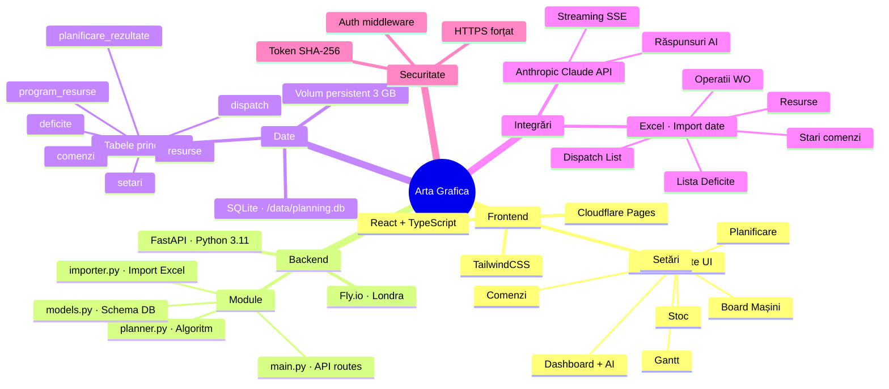
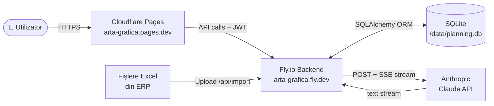
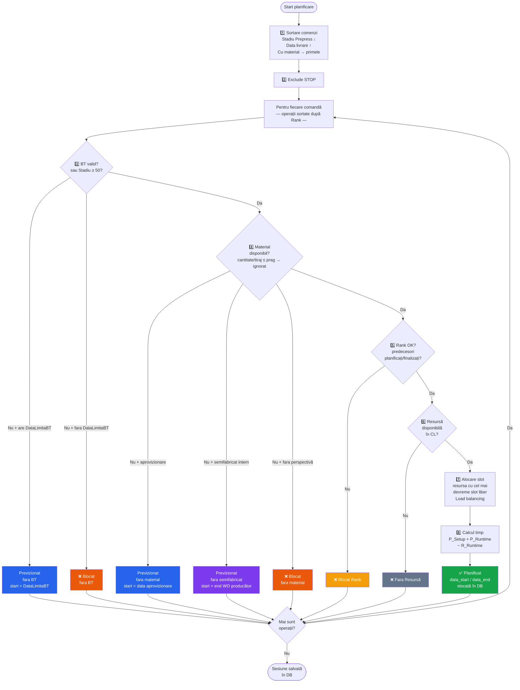
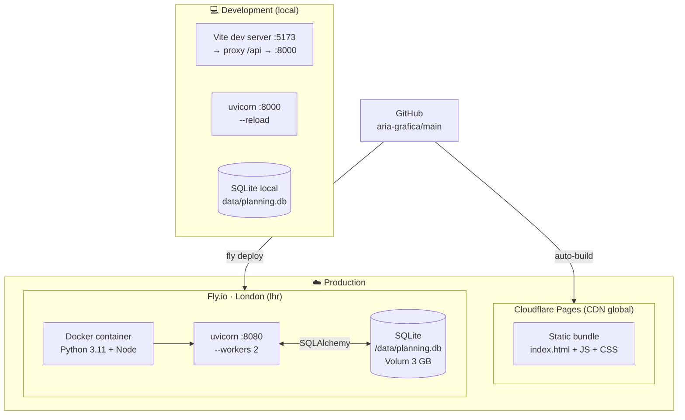

# Arhitectura Arta Grafica — Planificare Producție

## 1. Vedere de ansamblu (Mind Map)

---

## 2. Flux de date

---

## 3. Algoritmul de planificare

---

## 4. Deployment

---

## 5. Statusuri operații

| Status | Culoare | Semnificație |
|---|---|---|
| **Planificat** | 🟢 Verde | Slot alocat, BT + material OK |
| **Previzionat (fara BT)** | 🔵 Albastru | BT lipsă dar are DataLimitaBT |
| **Previzionat (fara material)** | 🔵 Albastru | Material vine prin aprovizionare |
| **Previzionat (semifabricat)** | 🔵 Albastru | Material produs de alt WO planificat |
| **Blocat (fara BT)** | 🟠 Portocaliu | Fara BT, fara DataLimitaBT |
| **Blocat (fara material)** | 🔴 Roșu | Stoc insuficient, fara aprovizionare |
| **Blocat (fara BT + material)** | 🔴 Roșu | Ambele lipsesc simultan |
| **Blocat Rank** | 🟡 Galben | Predecesori neplanificați |
| **Frozen — posibil** | 🟣 Violet | Înghețat, condițiile curente OK |
| **Frozen — imposibil** | 🟠 Portocaliu | Înghețat, BT sau material lipsesc acum |
